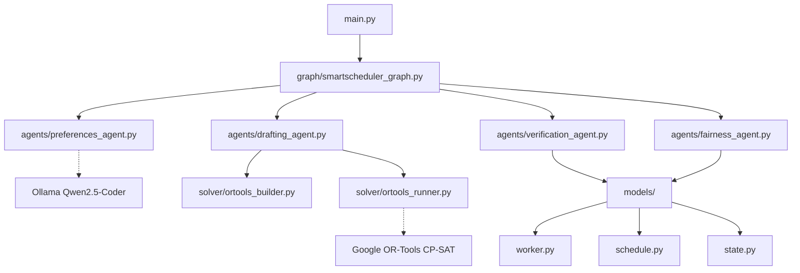
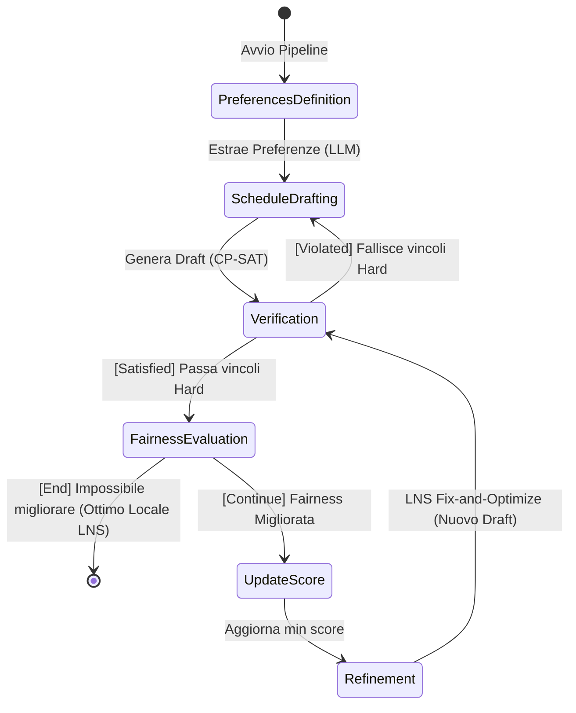

# 🏥 SmartScheduler — Hospital Shift Scheduling System (Extended Documentation)

**SmartScheduler** è un sistema "Agentic" multi-stadio avanzato, sviluppato per affrontare il complesso problema della turnazione del personale ospedaliero. Il progetto fonde tecniche di **Natural Language Understanding (NLU)** tramite Large Language Models (LLM) con potenti paradigmi di **Constraint Programming (CP-SAT di OR-Tools)**.

Questo documento fornisce una disamina estesa e profonda dell'architettura del codice, analizzando le classi Pydantic, i metodi dei Nodi LangGraph e le interazioni del flusso dati (StateGraph).

### Struttura Generale del Progetto

---

## 🏗️ 1. L'Architettura del Flusso Dati (LangGraph State)

Tutte le interazioni tra i file avvengono mutando e passando uno Stato Globale condiviso.

### Il Workflow (LangGraph)
Il diagramma di stato qui sotto mostra come l'applicazione cicla tra Nodi Simbolici e Modelli Matematici.

### `models/state.py`
Contiene la definizione `SmartSchedulerState` (eredita da `TypedDict`).
Ogni nodo di LangGraph riceve questa struttura e restituisce un dizionario parziale per aggiornarla:
- **Input iniziali:** `workers` (lista di oggetti Lavoratore), `use_case` ('A' o 'B').
- **Codice generato:** `ortools_preferences_code`, `ortools_schedule_code`.
- **Output:** `schedule` (istanza di `Schedule`), `violations` (lista di stringhe).
- **Metriche e Controllo LNS:** `fairness_metrics`, `least_satisfied_worker`, `previous_fairness_score`, `refinement_iteration`.

---

## 🧩 2. I Modelli Dati Core (`models/`)

Il progetto sfrutta la validazione ferrea di Pydantic per impedire *Type Error* durante il transito dei dati tra LLM e codice deterministico.

### `models/worker.py`
Modella l'anagrafica del dipendente.
- `WorkerType (Enum)`: Distingue tra `STANDARD` e `SPECIALIZED`.
- `ShiftPreference` & `Preference`: Pydantic Models che contengono i dati estratti dall'LLM. Salvano i `preferred_shifts` (con priorità), `unavailable_dates` (indisponibilità assolute), `night_tolerance` e `preferred_rest_day`.
- `Worker`: Aggrega ID, nome, tipo e l'oggetto `Preference` opzionale.

### `models/schedule.py`
Gestisce la complessa struttura del calendario generato dal solver.
- `ShiftType (Enum)`: Definisce `MORNING`, `AFTERNOON`, `NIGHT`. Contiene logica interna (`units()` e `hours()`) in cui la Notte pesa doppio (2 units, 12 ore).
- `ShiftAssignment`: Singolo mattone (Worker X, nel Giorno Y, fa il Turno Z).
- `Schedule`: La classe suprema che detiene l'array di `ShiftAssignment`.
  - **Metodi Chiave:**
    - `get_worker_assignments(worker_id)`: Filtra i turni di un medico.
    - `total_units_for_worker(...)`: Somma matematica delle Units mensili (necessaria per il constraint delle 25 units).
    - `total_hours_for_worker_in_window(...)`: Calcola le ore aggregate su una finestra di 7 giorni per verificare il limite legale delle 36h/settimana.

---

## 🧠 3. Gli Agenti e il Grafo (`agents/` e `graph/`)

Il cuore pulsante del sistema. L'orchestrazione è definita in `graph/smartscheduler_graph.py` chiamando la funzione `build_graph()` che istanzia il `StateGraph` e mappa la rete neurale del workflow.

### A. Stage 1: Preferences Agent (`agents/preferences_agent.py`)
- **`preferences_node(state)`**: Nodo di entrata.
- **Interazione:** Itera la lista dei `workers`. Per ognuno, chiama `_extract_preferences_for_worker()` che costruisce un Prompt contenente il testo naturale del dipendente. L'LLM (`qwen2.5`) elabora la biografia e risponde in JSON structurato. 
- **Generazione:** Il modulo chiama poi `_build_ortools_preferences_code(workers)` per tradurre le tolleranze numeriche JSON in stringhe Python native (`preference_weights["W01"] = {"morning":1, ...}`), che vengono salvate nello State come `ortools_preferences_code`.

### B. Stage 2 & 4: Drafting Agent (`agents/drafting_agent.py`)
È responsabile dell'interfacciamento con il Solver CP-SAT. Possiede due metodi distinti:
- **`drafting_node(state)`**: Usato al 1° giro. Prende l'`ortools_preferences_code` dallo State e chiama la funzione esterna `generate_ortools_template()` passandogli i dati. Genera il modello e chiama `run_ortools_code()`. Se fallisce, restituisce una violation.
- **`refinement_node(state)`**: Il loop dell'algoritmo **LNS (Fix-and-Optimize)**. 
  - **Interazione LNS:** Estrae dallo State il `least_satisfied_worker` e le `fairness_metrics`. Ordina l'array dei medici per "felicità". Trova il 50% più felice (`Donors`) e il 50% rimanente. 
  - Legge l'oggetto `Schedule` precedente e costruisce una stringa di equazioni booleane `model.Add(shift == X)` per congelare (Fix) le posizioni dei medici stabili. 
  - Incrementa violentemente la penalità del turno più odiato dal `least_satisfied_worker` in modo che il Solver eviti di ridarglielo.
  - Se il nuovo template va in `INFEASIBLE`, la funzione sa di aver sbattuto contro il tetto (Ottimo Locale) e restituisce dolcemente lo `Schedule` dell'iterazione precedente, chiudendo il loop.

### C. Stage 3a: Verification Agent (`agents/verification_agent.py`)
- **`verify_hard_constraints(...)`**: Un rule-engine spietato scritto in puro Python. 
  - **Interazione:** Non usa modelli CP-SAT, ma reitera fisicamente il calendario (`Schedule`) controllando i 7 vincoli legali imposti dalla traccia (Copertura dipendenti, Massimale orario settimanale `total_hours_for_worker_in_window`, obbligo di 2 riposi post-notte).
- **`check_hard_constraints(state)`**: Funzione "Edge" condizionale (Router) di LangGraph. Se `verify_hard_constraints` ha restituito violazioni, instrada il grafo indietro a `drafting` per un ritentativo. Se non ci sono violazioni, instrada a `fairness_evaluation`.

### D. Stage 3b: Fairness Agent (`agents/fairness_agent.py`)
- **`compute_fairness_score(...)`**: L'algoritmo calcola l'equità. Incrocia le assegnazioni nel calendario con l'oggetto `Preference` di ciascun lavoratore. Calcola le multe aritmetiche (ha lavorato in un festivo? penalità. Ha fatto 8 notti ma la sua tolleranza era 1? penalità). Normalizza i punteggi a un livello (0-1).
- **`check_fairness_improvement(state)`**: Router Router condizionale. Controlla se il `min(score_attuale)` è > `min(score_precedente)`.
  - Se SÌ: Permette al grafo di passare a `refinement` (che rilancerà l'LNS).
  - Se NO: Comprende che l'LNS non produce più benefici reali. Ritorna `"end"` e chiude ufficialmente il LangGraph.

---

## ⚙️ 4. Il Core Matematico (`solver/`)

Lontano dalla logica agentica, questi file trattano strettamente l'algebra computazionale booleana.

### `solver/ortools_builder.py`
Costruisce dinamicamente lo script per CP-SAT.
- **`generate_ortools_template(...)`**: Metodo Factory. Assembla una massiccia stringa contenente variabili e vincoli. 
  - Genera i dizionari `shift_vars[(w, d, s)]` (Variabili Booleane OR-Tools).
  - Gestisce l'iniezione del codice LLM (`preferences_code`).
  - Esegue la macro `_build_coverage_section` per ramificare le equazioni in base all'**Use Case** (Scenario A: `sum >= 2` per tutti. Scenario B: `sum >= 3` totale di cui almeno `sum(specializzati) >= 1`).
  - Implementa la Funzione Obiettivo di OR-Tools minimizzando la somma delle multe dei turni scomodi `model.Minimize(sum(penalty_terms))`.

### `solver/ortools_runner.py`
Isolamento del kernel.
- **`run_ortools_code(code)`**: Prende il malloppo stringa generato e, usando il modulo `subprocess`, lancia l'interprete Python in una sandbox testuale. Questo garantisce che se lo script generato ha leak di memoria o entra in loop infiniti, il processo base `main.py` non crasha, ma chiude il thread al `timeout=60`.
- **`parse_solver_result(...)`**: Ricostruisce le righe di standard output ("OPTIMAL", JSON dictionary) convertendole nella magnifica e sicura istanza Pydantic `Schedule` usata dal resto dell'app.

---

## 🖥️ 5. Il Motore Principale (`main.py`)

Il file `main.py` orchestra il mondo esterno.
- **`load_workers_from_scenario()`**: Esegue parsing Regex di file YAML-like (`scenarios/`) istanziando l'anagrafica base dei `Worker`.
- **`main()`**: 
  - Istanzia `initial_state` come dizionario grezzo e lo getta in pasto ad `app.invoke(initial_state)` (l'oggetto LangGraph esportato da `smartscheduler_graph.py`).
  - Attende il completamente del loop iterativo (che può durare vari secondi a causa del refinement LNS).
- **`generate_report(final_state)`**: Estrae lo `Schedule` finale validato dal Grafo. Calcola istogrammi visuali in caratteri Unicode (`██████░░`) incrociando iterativamente giorni, medici e valutazioni colore.
- **`save_outputs()`**: Esegue l'I/O finale su file system, esportando sia la dashboard testuale che un JSON serializzato della turnazione.
