# 🏗️ Grafo Dettagliato della Pipeline SmartScheduler

> Documentazione completa del flusso di esecuzione end-to-end del sistema SmartScheduler.
> Ogni nodo, arco, oggetto modificato, input/output e metodo è descritto in dettaglio.

---

## 📐 Diagramma Generale del Grafo (LangGraph StateGraph)

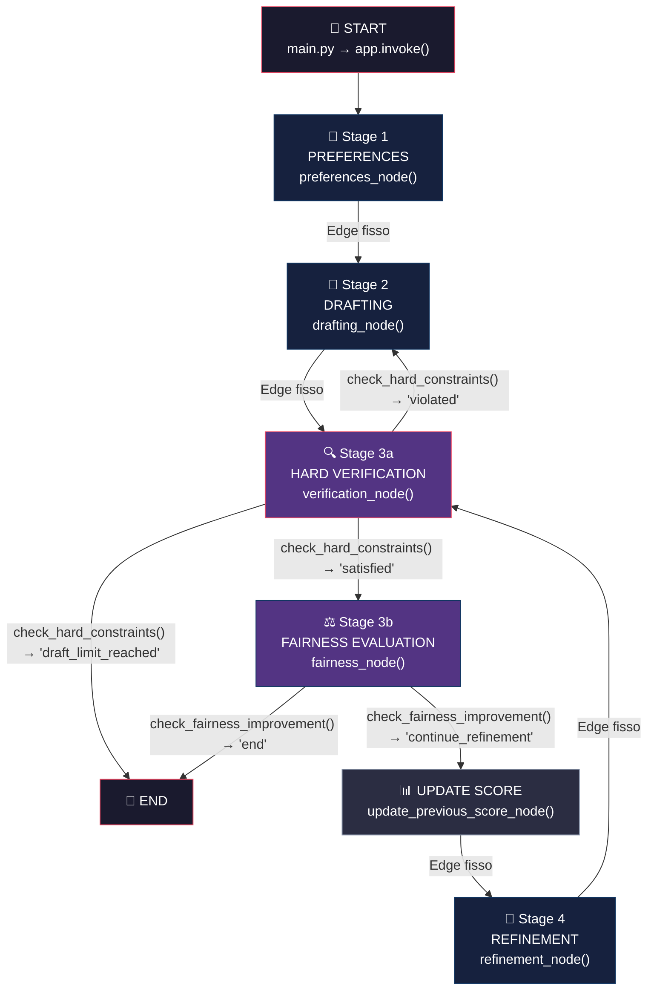

---

## 📋 Indice

1. [Fase 0 — Inizializzazione (main.py)](#fase-0--inizializzazione)
2. [Stage 1 — Preferences Definition](#stage-1--preferences-definition)
3. [Stage 2 — Schedule Drafting](#stage-2--schedule-drafting)
4. [Stage 3a — Hard Constraint Verification](#stage-3a--hard-constraint-verification)
5. [Arco Condizionale: hard_verification → (drafting | fairness | END)](#arco-condizionale-1-hard-verification)
6. [Stage 3b — Fairness Evaluation](#stage-3b--fairness-evaluation)
7. [Arco Condizionale: fairness_evaluation → (update_score | END)](#arco-condizionale-2-fairness-evaluation)
8. [Nodo Intermedio — Update Previous Score](#nodo-intermedio--update-previous-score)
9. [Stage 4 — Fairness Refinement](#stage-4--fairness-refinement)
10. [Fase Finale — Output e Report](#fase-finale--output-e-report)
11. [Mappa Completa delle Classi](#mappa-completa-delle-classi)
12. [Mappa Completa dei Moduli e Metodi](#mappa-completa-dei-moduli-e-metodi)
13. [Stato Condiviso (SmartSchedulerState)](#stato-condiviso)

---

## Fase 0 — Inizializzazione

### File: `main.py`

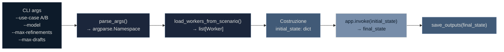

### Dettaglio

| Aspetto | Descrizione |
|---------|-------------|
| **Entry point** | `main()` in `main.py` |
| **Metodi chiamati** | `parse_args()`, `load_workers_from_scenario(use_case)`, `app.invoke(initial_state)`, `save_outputs(final_state, use_case)` |
| **Input** | Argomenti CLI: `--use-case` (A/B), `--model`, `--max-refinements`, `--max-drafts`, `--verbose` |
| **File letti** | `data/scenarios/use_case_a.txt` o `use_case_b.txt` — formato YAML-like con blocchi worker |
| **Parsing** | Regex pattern che estrae: `id`, `name`, `type` (standard/specialized), `preferences` (testo NL) |
| **Oggetti creati** | `Worker(id, name, worker_type, preference=Preference(raw_text=...))` per ogni lavoratore |
| **Stato iniziale** | `dict` con chiavi: `workers`, `use_case`, `schedule=None`, `draft_iteration=0`, `max_draft_iterations`, `violations=[]`, `fairness_metrics={}`, `refinement_iteration=0`, `max_refinements` |
| **Output** | Lo stato iniziale viene passato a `app.invoke()` (il grafo LangGraph compilato) |

### Classi coinvolte

| Classe | Modulo | Ruolo |
|--------|--------|-------|
| `Worker` | `models/worker.py` | Modello Pydantic del lavoratore con id, name, worker_type, preference |
| `WorkerType` | `models/worker.py` | Enum: `STANDARD`, `SPECIALIZED` |
| `Preference` | `models/worker.py` | Modello Pydantic delle preferenze — inizializzato solo con `raw_text` |

---

## Stage 1 — Preferences Definition

### File: `agents/preferences_agent.py`

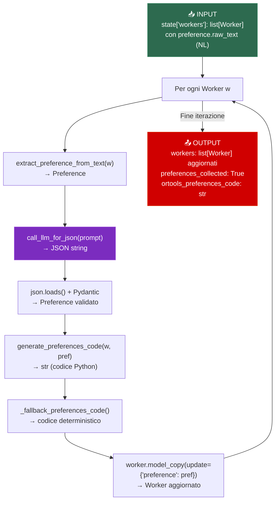

### Arco: `START → preferences` (entry point del grafo)

| Aspetto | Dettaglio |
|---------|-----------|
| **Tipo arco** | Entry point (`workflow.set_entry_point("preferences")`) |
| **Oggetti in ingresso** | `state["workers"]`: `list[Worker]` con `preference.raw_text` in linguaggio naturale |
| **Oggetti in uscita** | `list[Worker]` aggiornati con `Preference` strutturata, `ortools_preferences_code: str` |

### Metodi e funzioni dettagliati

| Metodo | Modulo | Input | Output | Descrizione |
|--------|--------|-------|--------|-------------|
| `preferences_node(state)` | `agents/preferences_agent.py` | `SmartSchedulerState` | `dict` con `workers`, `preferences_collected`, `ortools_preferences_code` | Nodo LangGraph principale — itera su tutti i worker |
| `extract_preference_from_text(worker)` | `agents/preferences_agent.py` | `Worker` | `Preference` | Chiama LLM per estrarre preferenze dal testo NL |
| `call_llm_for_json(prompt, system_prompt)` | `agents/base_llm.py` | `str`, `str` | `str` (JSON) | Wrapper Ollama con temperatura 0.1, richiede output JSON |
| `build_preferences_prompt(worker)` | `prompts/preferences_prompt.py` | `Worker` | `str` | Costruisce il prompt con schema JSON, esempi, e testo NL del worker |
| `generate_preferences_code(worker, pref)` | `agents/preferences_agent.py` | `Worker`, `Preference` | `str` | Genera codice Python per OR-Tools (usa sempre fallback deterministico) |
| `_fallback_preferences_code(worker_id, pref)` | `agents/preferences_agent.py` | `str`, `Preference` | `str` | Genera `preference_weights[wid]`, `night_tolerances[wid]`, `holiday_tolerances[wid]`, `unavailable_dates[wid]`, `preferred_rest_day[wid]` |
| `Worker.model_copy(update={...})` | Pydantic | `Worker` | `Worker` | Crea una copia del Worker con le preferenze strutturate aggiornate |

### Oggetti modificati nello stato

| Campo stato | Prima | Dopo |
|-------------|-------|------|
| `workers` | `list[Worker]` con `preference.raw_text` solo | `list[Worker]` con `Preference` completa (preferred_shifts, unavailable_dates, night_tolerance, etc.) |
| `preferences_collected` | non presente | `True` |
| `ortools_preferences_code` | non presente | `str` — blocco di codice Python con tutti i dizionari preference_weights, night_tolerances, etc. |

### Struttura dei dati generati

```python
# Esempio di ortools_preferences_code generato
preference_weights["W01"] = {'morning': 0, 'afternoon': 1, 'night': 5}
night_tolerances["W01"] = 0
holiday_tolerances["W01"] = 2
unavailable_dates["W01"] = {18}  # 25 dicembre (day_idx 18)
preferred_rest_day["W01"] = 6    # Domenica
```

---

## Stage 2 — Schedule Drafting

### File: `agents/drafting_agent.py`

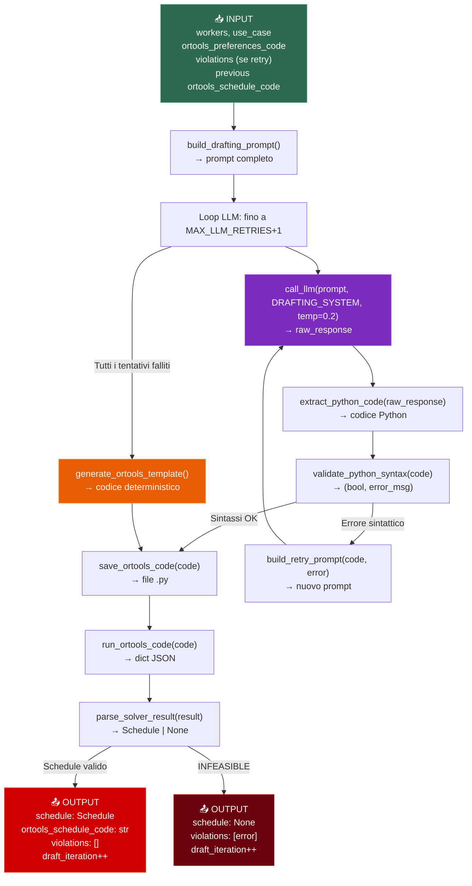

### Arco: `preferences → drafting` (Edge fisso)

| Aspetto | Dettaglio |
|---------|-----------|
| **Tipo arco** | Edge fisso (`workflow.add_edge("preferences", "drafting")`) |
| **Dati trasmessi** | Stato aggiornato: `workers` con Preference, `ortools_preferences_code` |
| **Condizione** | Nessuna — sempre eseguito dopo preferences |

### Metodi e funzioni dettagliati

| Metodo | Modulo | Input | Output | Descrizione |
|--------|--------|-------|--------|-------------|
| `drafting_node(state)` | `agents/drafting_agent.py` | `SmartSchedulerState` | `dict` con `schedule`, `ortools_schedule_code`, `violations`, `draft_iteration`, `llm_drafting_success`, `llm_drafting_attempts` | Nodo principale — genera lo schedule via LLM + fallback |
| `build_drafting_prompt(...)` | `prompts/drafting_prompt.py` | workers, use_case, preferences_code, horizon, violations, previous_code | `str` | Prompt con tutti i vincoli hard, preferenze, e eventuali violazioni da correggere |
| `call_llm(prompt, system_prompt, temperature)` | `agents/base_llm.py` | `str`, `str`, `float` | `str` | Chiamata Ollama via `ollama.chat()` |
| `extract_python_code(response)` | `agents/drafting_agent.py` | `str` | `str` | Estrae blocco ` ```python...``` ` dalla risposta LLM |
| `validate_python_syntax(code)` | `agents/drafting_agent.py` | `str` | `(bool, str)` | `compile(code, ..., "exec")` — verifica sintattica |
| `build_retry_prompt(failed_code, error)` | `prompts/drafting_prompt.py` | `str`, `str` | `str` | Prompt di correzione con errore sintattico |
| `generate_ortools_template(...)` | `solver/ortools_builder.py` | workers, horizon_start/end, use_case, preferences_code | `str` | Template deterministico OR-Tools CP-SAT con tutti i vincoli hard + soft |
| `build_days_list(start, end)` | `solver/ortools_builder.py` | `date`, `date` | `list[str]` | Lista di date ISO nell'orizzonte |
| `run_ortools_code(code)` | `solver/ortools_runner.py` | `str` | `dict` | Esegue in subprocess, cattura stdout JSON |
| `parse_solver_result(result, workers, ...)` | `agents/drafting_agent.py` | `dict`, `list[Worker]`, `date`, `date`, `str` | `Schedule \| None` | Converte JSON assignments in oggetti `ShiftAssignment` → `Schedule` |
| `save_ortools_code(code, filename)` | `agents/drafting_agent.py` | `str`, `str` | `str` (path) | Salva file in `output/` |

### Oggetti modificati nello stato

| Campo stato | Prima | Dopo (successo) | Dopo (fallimento) |
|-------------|-------|-----------------|-------------------|
| `draft_iteration` | N | N+1 | N+1 |
| `schedule` | `None` o precedente | `Schedule(assignments=[...], ...)` | invariato |
| `ortools_schedule_code` | `""` o precedente | codice Python completo | invariato |
| `violations` | `[]` o precedente | `[]` | `[error_message]` |
| `llm_drafting_success` | non presente | `True` se LLM ha funzionato | `False` |
| `llm_drafting_attempts` | non presente | N tentativi LLM | N tentativi LLM |

### Classi coinvolte

| Classe | Ruolo |
|--------|-------|
| `Schedule` | Oggetto Pydantic creato con `assignments`, `horizon_start`, `horizon_end`, `use_case` |
| `ShiftAssignment` | Singola assegnazione `(worker_id, date, shift_type)` |
| `ShiftType` | Enum: `MORNING` (1 unit, 6h), `AFTERNOON` (1 unit, 6h), `NIGHT` (2 units, 12h) |

---

## Stage 3a — Hard Constraint Verification

### File: `agents/verification_agent.py`

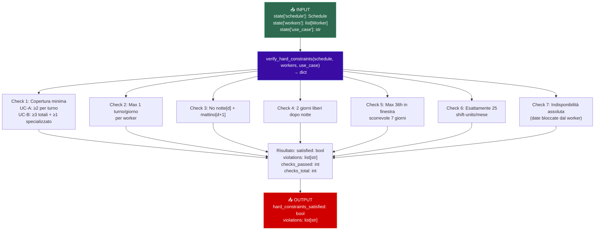

### Arco: `drafting → hard_verification` (Edge fisso)

| Aspetto | Dettaglio |
|---------|-----------|
| **Tipo arco** | Edge fisso (`workflow.add_edge("drafting", "hard_verification")`) |
| **Dati trasmessi** | `schedule` (Schedule o None), `workers`, `use_case` |
| **Condizione** | Nessuna — sempre eseguito dopo drafting |

### Arco: `refinement → hard_verification` (Edge fisso)

| Aspetto | Dettaglio |
|---------|-----------|
| **Tipo arco** | Edge fisso (`workflow.add_edge("refinement", "hard_verification")`) |
| **Dati trasmessi** | `schedule` aggiornato dal refinement |

### Metodi e funzioni dettagliati

| Metodo | Modulo | Input | Output | Descrizione |
|--------|--------|-------|--------|-------------|
| `verification_node(state)` | `agents/verification_agent.py` | `SmartSchedulerState` | `dict` con `hard_constraints_satisfied`, `violations` | Nodo LangGraph — wrapper di verify_hard_constraints |
| `verify_hard_constraints(schedule, workers, use_case)` | `agents/verification_agent.py` | `Schedule`, `list[Worker]`, `str` | `dict` con `satisfied`, `violations`, `checks_passed`, `checks_total` | Verifica deterministica di 7 vincoli hard |
| `_get_days(start, end)` | `agents/verification_agent.py` | `date`, `date` | `list[date]` | Genera lista date nell'orizzonte |

### Dettaglio dei 7 vincoli hard verificati

| # | Nome | Vincolo | Formato violazione |
|---|------|---------|-------------------|
| 1 | Copertura minima | UC-A: ≥2 worker/turno; UC-B: ≥3 totali + ≥1 specializzato | `[COPERTURA] 2026-12-07 morning: 1 worker assegnati, minimo 2` |
| 2 | Max 1 turno/giorno | Ogni worker ha al massimo 1 turno per giorno | `[MAX_1_TURNO] W01 — 2026-12-07: assegnato a 2 turni` |
| 3 | No turni consecutivi | notte[d] + mattino[d+1] ≤ 1 | `[CONSECUTIVI] W01 — notte del 2026-12-07 seguita da mattino del 2026-12-08` |
| 4 | Riposo dopo notte | 2 giorni liberi obbligatori dopo ogni turno notturno | `[RIPOSO_NOTTE] W01 — dopo notte del 2026-12-07, lavora il 2026-12-08` |
| 5 | Max ore settimanali | ≤36 ore in qualsiasi finestra scorrevole di 7 giorni | `[ORE_SETTIMANA] W01 — finestra ...: 42h > 36h` |
| 6 | Shift-units mensili | Esattamente 25 shift-units per worker nel mese | `[SHIFT_UNITS] W01: 23 shift-units (atteso esattamente 25)` |
| 7 | Indisponibilità | Worker non lavora nelle sue date di indisponibilità assoluta | `[INDISPONIBILITA] W01 — lavora il 2026-12-25` |

### Strutture dati interne

```python
# Pre-calcolate per accesso rapido:
wds: dict[tuple[str, date], list[ShiftType]]   # (worker_id, date) → lista turni
dsw: dict[tuple[date, ShiftType], list[str]]    # (date, shift_type) → lista worker_ids
```

---

## Arco Condizionale 1: hard_verification

### Funzione: `check_hard_constraints(state) → str`

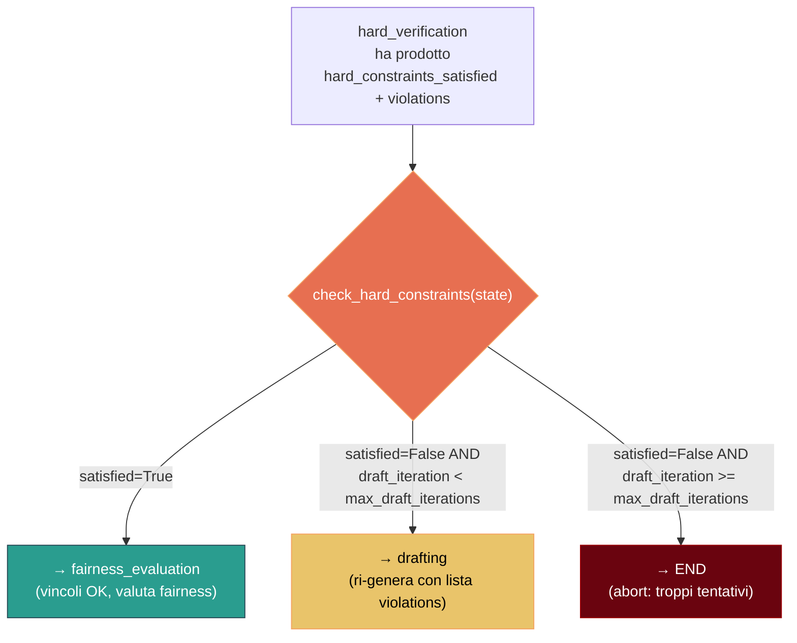

| Ramo | Condizione | Destinazione | Oggetti sul bordo |
|------|-----------|-------------|-------------------|
| `"satisfied"` | `hard_constraints_satisfied == True` | `fairness_evaluation` | Schedule verificato (tutti i vincoli passati) |
| `"violated"` | `hard_constraints_satisfied == False` AND `draft_iteration < max_draft_iterations` | `drafting` | `violations: list[str]` — lista delle violazioni trovate; il drafting le usa nel prompt |
| `"draft_limit_reached"` | `hard_constraints_satisfied == False` AND `draft_iteration >= max_draft_iterations` | `END` | Schedule non valido — pipeline termina |

---

## Stage 3b — Fairness Evaluation

### File: `agents/fairness_agent.py` + `solver/fairness_metrics.py`

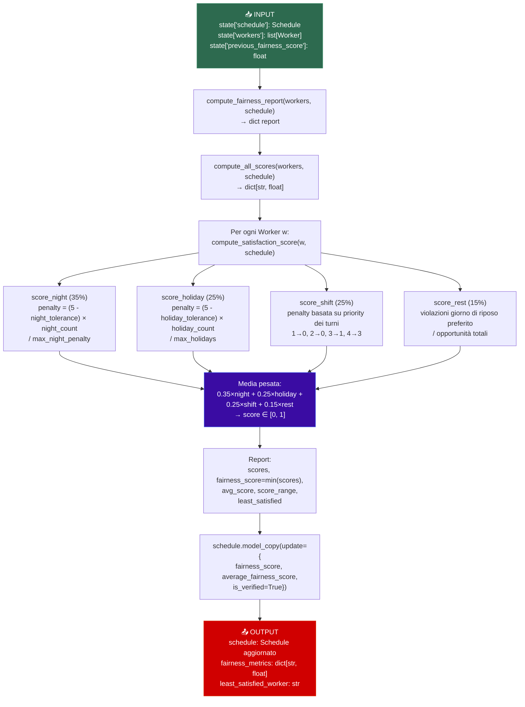

### Arco: `hard_verification → fairness_evaluation` (da check condizionale, ramo `"satisfied"`)

| Aspetto | Dettaglio |
|---------|-----------|
| **Tipo arco** | Arco condizionale (`check_hard_constraints() → "satisfied"`) |
| **Dati trasmessi** | `schedule` con tutti i vincoli hard soddisfatti |

### Metodi e funzioni dettagliati

| Metodo | Modulo | Input | Output | Descrizione |
|--------|--------|-------|--------|-------------|
| `fairness_node(state)` | `agents/fairness_agent.py` | `SmartSchedulerState` | `dict` con `schedule`, `fairness_metrics`, `least_satisfied_worker`, `previous_fairness_score` | Nodo LangGraph — calcola fairness e aggiorna schedule |
| `compute_fairness_report(workers, schedule)` | `solver/fairness_metrics.py` | `list[Worker]`, `Schedule` | `dict` con `scores`, `least_satisfied`, `fairness_score`, `avg_score`, `score_range` | Report completo fairness |
| `compute_all_scores(workers, schedule)` | `solver/fairness_metrics.py` | `list[Worker]`, `Schedule` | `dict[str, float]` | Mappa worker_id → satisfaction_score |
| `compute_satisfaction_score(worker, schedule)` | `solver/fairness_metrics.py` | `Worker`, `Schedule` | `float` ∈ [0,1] | Calcolo 4 componenti pesati |
| `find_least_satisfied(scores)` | `solver/fairness_metrics.py` | `dict[str, float]` | `str \| None` | `min(scores, key=...)` |
| `Schedule.model_copy(update={...})` | Pydantic | `Schedule` | `Schedule` | Crea copia con fairness_score aggiornato |

### Oggetti modificati nello stato

| Campo stato | Prima | Dopo |
|-------------|-------|------|
| `schedule` | Schedule (senza fairness) | Schedule con `fairness_score`, `average_fairness_score`, `is_verified=True` |
| `fairness_metrics` | `{}` | `{"W01": 0.723, "W02": 0.841, ...}` |
| `least_satisfied_worker` | `None` | `"W01"` (worker con score minimo) |

### Formula satisfaction score

```
score(w) = 0.35 × score_night(w) + 0.25 × score_holiday(w) + 0.25 × score_shift(w) + 0.15 × score_rest(w)

Dove:
  score_night   = 1 - (night_weight × night_count) / (night_weight × max_nights)
  score_holiday = 1 - (holiday_weight × holiday_count) / (holiday_weight × max_holidays)
  score_shift   = 1 - Σ penalty(shift_priority) / (3 × total_assignments)
  score_rest    = 1 - rest_violations / rest_opportunities

  night_weight   = max(0, 5 - night_tolerance)
  holiday_weight = max(0, 5 - holiday_tolerance)
  shift_priority_map = {1: 0, 2: 0, 3: 1, 4: 3}
```

---

## Arco Condizionale 2: fairness_evaluation

### Funzione: `check_fairness_improvement(state) → str`

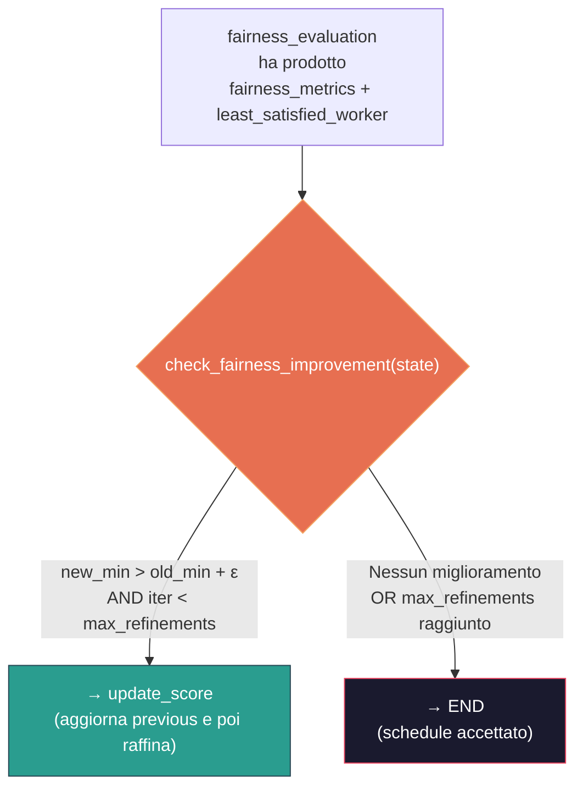

| Ramo | Condizione | Destinazione | Oggetti sul bordo |
|------|-----------|-------------|-------------------|
| `"continue_refinement"` | `new_min > old_min + 1e-6` AND `refinement_iteration < max_refinements` | `update_score` | `fairness_metrics`, `least_satisfied_worker` — usati dal refinement |
| `"end"` | Nessun miglioramento (plateau) OPPURE limite iterazioni raggiunto | `END` | Schedule finale con fairness_score e is_verified=True |

---

## Nodo Intermedio — Update Previous Score

### File: `agents/fairness_agent.py` → `update_previous_score_node()`

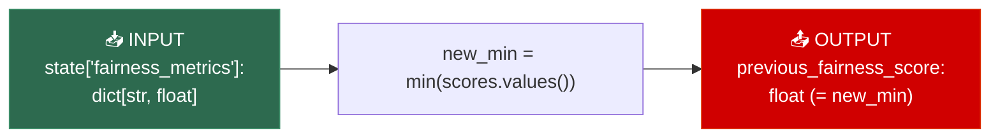

### Arco: `fairness_evaluation → update_score` (da check condizionale, ramo `"continue_refinement"`)

| Aspetto | Dettaglio |
|---------|-----------|
| **Tipo arco** | Arco condizionale (`check_fairness_improvement() → "continue_refinement"`) |
| **Metodo** | `update_previous_score_node(state) → {"previous_fairness_score": new_min}` |
| **Scopo** | Memorizza il min(scores) corrente PRIMA del refinement, per poterlo confrontare con il prossimo |

### Arco: `update_score → refinement` (Edge fisso)

| Aspetto | Dettaglio |
|---------|-----------|
| **Tipo arco** | Edge fisso (`workflow.add_edge("update_score", "refinement")`) |
| **Dati trasmessi** | `previous_fairness_score` aggiornato |

---

## Stage 4 — Fairness Refinement

### File: `agents/drafting_agent.py`

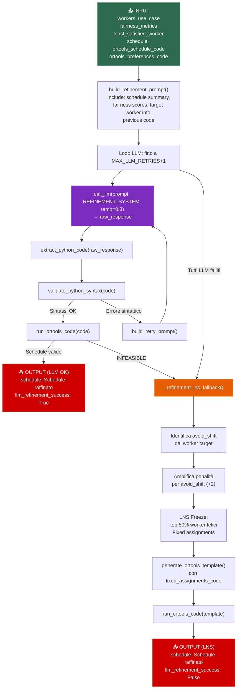

### Metodi e funzioni dettagliati

| Metodo | Modulo | Input | Output | Descrizione |
|--------|--------|-------|--------|-------------|
| `refinement_node(state)` | `agents/drafting_agent.py` | `SmartSchedulerState` | `dict` con schedule, code, iterations, llm_success | Nodo principale — LLM + fallback LNS |
| `build_refinement_prompt(...)` | `prompts/refinement_prompt.py` | schedule_summary, workers, least_satisfied, fairness_metrics, preferences_code, previous_code, use_case, horizon, days | `str` | Prompt dettagliato con schedule corrente, scores, e strategia suggerita |
| `format_schedule_for_prompt(schedule, workers, start, end)` | `prompts/refinement_prompt.py` | `Schedule`, `list[Worker]`, `date`, `date` | `str` | Formato tabellare: `W01 (Luca): 07/12=morning, 08/12=afternoon, ...` |
| `format_fairness_summary(metrics, workers)` | `prompts/refinement_prompt.py` | `dict[str, float]`, `list[Worker]` | `str` | Summary con barre: `W01 (Luca): [████████░░] 0.841` |
| `_refinement_lns_fallback(state)` | `agents/drafting_agent.py` | `SmartSchedulerState` | `dict` | Fallback Large Neighborhood Search deterministico |

### Dettaglio Fallback LNS (`_refinement_lns_fallback`)

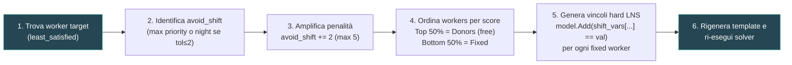

| Passo | Oggetti coinvolti | Dettaglio |
|-------|-------------------|-----------|
| Identifica target | `target_worker: Worker`, `pref: Preference` | `next(w for w in workers if w.id == least_satisfied)` |
| Identifica avoid_shift | `shift_priority_map: dict` | `max(["morning","afternoon","night"], key=priority)` o `"night"` se `night_tolerance ≤ 2` |
| Amplifica penalità | `refined_prefs_code: str` | Modifica riga `preference_weights["Wxx"]` nel codice |
| LNS Freeze | `sorted_workers`, `donors: set`, `fixed_workers_ids: list` | Top 50% più felici → free, bottom 50% → freezed |
| Fixed assignments | `fixed_assignments_code: str` | Genera `model.Add(shift_vars[(...)] == 0/1)` per ogni turno/giorno dei worker freezed |
| Esecuzione | `generate_ortools_template(fixed_assignments_code=...)` | Template con vincoli hard aggiuntivi per LNS |

### Oggetti modificati nello stato

| Campo stato | Prima | Dopo |
|-------------|-------|------|
| `refinement_iteration` | N | N+1 |
| `schedule` | Schedule precedente | Schedule raffinato (se solver OK) o invariato |
| `ortools_schedule_code` | codice precedente | nuovo codice |
| `ortools_preferences_code` | pref code precedente | pref code con penalità amplificata (solo LNS) |
| `violations` | `[]` | `[]` o `["LNS Fallito - Ottimo locale raggiunto"]` |
| `llm_refinement_success` | non presente | `True` (LLM OK) o `False` (fallback LNS) |
| `llm_refinement_attempts` | non presente | N tentativi LLM effettuati |

---

## Fase Finale — Output e Report

### File: `main.py`

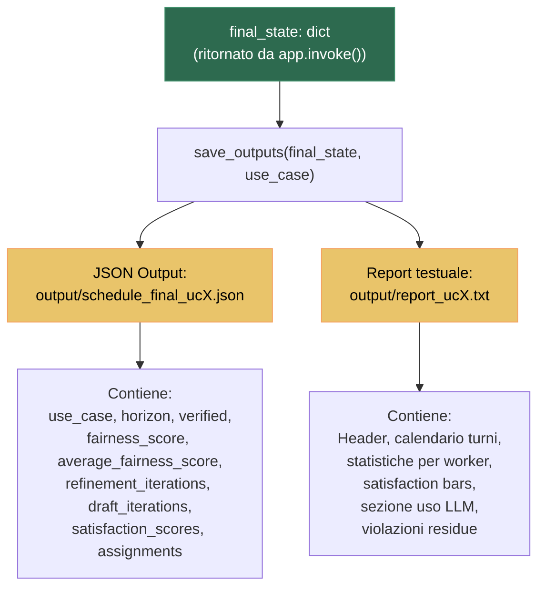

### Metodi della fase finale

| Metodo | Input | Output | Descrizione |
|--------|-------|--------|-------------|
| `save_outputs(final_state, use_case)` | `dict`, `str` | File JSON + TXT | Salva il report completo |
| `generate_report(final_state, use_case)` | `dict`, `str` | `str` | Genera report testuale con calendario, statistiche, barre satisfaction |
| `Schedule.get_day_schedule(date)` | `date` | `DaySchedule` | Turni del giorno (morning, afternoon, night) |
| `Schedule.get_worker_assignments(worker_id)` | `str` | `list[ShiftAssignment]` | Tutti i turni di un worker |
| `Schedule.total_units_for_worker(worker_id)` | `str` | `int` | Shift-units totali |

---

## Mappa Completa delle Classi

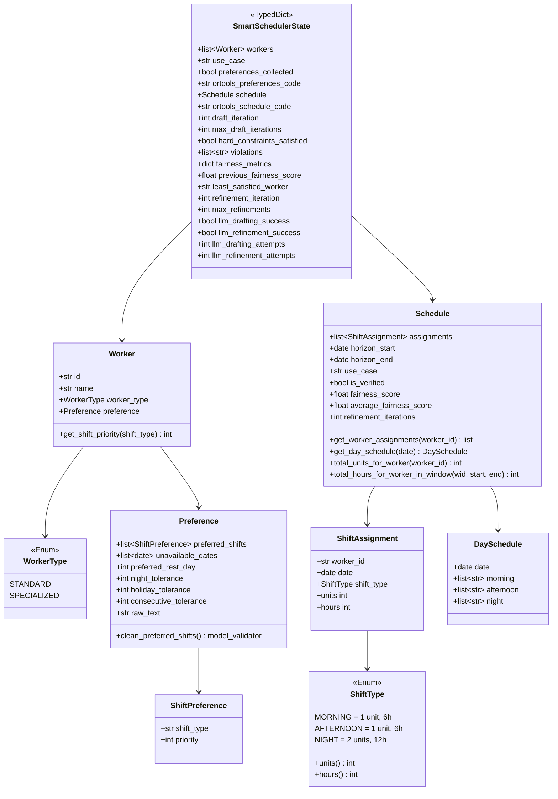

---

## Mappa Completa dei Moduli e Metodi

### `main.py`
| Funzione | Tipo | Chiamata da | Chiama |
|----------|------|-------------|--------|
| `main()` | Entry point | CLI | `parse_args()`, `load_workers_from_scenario()`, `app.invoke()`, `save_outputs()` |
| `parse_args()` | Utility | `main()` | `argparse` |
| `load_workers_from_scenario(use_case)` | Parsing | `main()` | `Worker()`, `Preference()` |
| `generate_report(final_state, use_case)` | Output | `save_outputs()` | `Schedule.get_day_schedule()`, `Schedule.get_worker_assignments()` |
| `save_outputs(final_state, use_case)` | Output | `main()` | `generate_report()`, `json.dump()` |

### `agents/base_llm.py`
| Funzione | Tipo | Chiamata da | Chiama |
|----------|------|-------------|--------|
| `call_llm(prompt, model, system_prompt, temperature)` | LLM wrapper | `drafting_node`, `refinement_node` | `ollama.chat()` |
| `call_llm_for_json(prompt, model, system_prompt)` | LLM wrapper (JSON) | `extract_preference_from_text` | `call_llm()` con temp=0.1 |

### `agents/preferences_agent.py`
| Funzione | Tipo | Chiamata da | Chiama |
|----------|------|-------------|--------|
| `preferences_node(state)` | Nodo LangGraph | Grafo (Stage 1) | `extract_preference_from_text()`, `generate_preferences_code()` |
| `extract_preference_from_text(worker)` | LLM + Parsing | `preferences_node` | `call_llm_for_json()`, `build_preferences_prompt()` |
| `generate_preferences_code(worker, pref)` | Codegen | `preferences_node` | `_fallback_preferences_code()` |
| `_fallback_preferences_code(wid, pref)` | Codegen deterministico | `generate_preferences_code` | — |

### `agents/drafting_agent.py`
| Funzione | Tipo | Chiamata da | Chiama |
|----------|------|-------------|--------|
| `drafting_node(state)` | Nodo LangGraph | Grafo (Stage 2) | `build_drafting_prompt()`, `call_llm()`, `extract_python_code()`, `validate_python_syntax()`, `generate_ortools_template()`, `run_ortools_code()`, `parse_solver_result()` |
| `refinement_node(state)` | Nodo LangGraph | Grafo (Stage 4) | `build_refinement_prompt()`, `call_llm()`, `extract_python_code()`, `validate_python_syntax()`, `run_ortools_code()`, `parse_solver_result()`, `_refinement_lns_fallback()` |
| `extract_python_code(response)` | Parsing | `drafting_node`, `refinement_node` | `re.search()` |
| `validate_python_syntax(code)` | Validazione | `drafting_node`, `refinement_node` | `compile()` |
| `parse_solver_result(result, ...)` | Parsing | `drafting_node`, `refinement_node`, `_refinement_lns_fallback` | `ShiftAssignment()`, `Schedule()` |
| `save_ortools_code(code, filename)` | I/O | `drafting_node`, `refinement_node`, `_refinement_lns_fallback` | `open()` |
| `_refinement_lns_fallback(state)` | Fallback LNS | `refinement_node` | `generate_ortools_template()`, `run_ortools_code()`, `parse_solver_result()` |

### `agents/verification_agent.py`
| Funzione | Tipo | Chiamata da | Chiama |
|----------|------|-------------|--------|
| `verification_node(state)` | Nodo LangGraph | Grafo (Stage 3a) | `verify_hard_constraints()` |
| `verify_hard_constraints(schedule, workers, use_case)` | Verifica deterministica | `verification_node` | `Schedule.total_units_for_worker()`, `_get_days()` |
| `check_hard_constraints(state)` | Funzione condizionale | Grafo (edge condizionale) | — |
| `_get_days(start, end)` | Utility | `verify_hard_constraints` | — |

### `agents/fairness_agent.py`
| Funzione | Tipo | Chiamata da | Chiama |
|----------|------|-------------|--------|
| `fairness_node(state)` | Nodo LangGraph | Grafo (Stage 3b) | `compute_fairness_report()`, `Schedule.model_copy()` |
| `check_fairness_improvement(state)` | Funzione condizionale | Grafo (edge condizionale) | — |
| `update_previous_score_node(state)` | Nodo LangGraph | Grafo (update_score) | — |

### `solver/ortools_builder.py`
| Funzione | Tipo | Chiamata da | Chiama |
|----------|------|-------------|--------|
| `generate_ortools_template(workers, ...)` | Codegen | `drafting_node`, `_refinement_lns_fallback` | `build_days_list()`, `_build_coverage_section()` |
| `build_days_list(start, end)` | Utility | `generate_ortools_template`, `drafting_node`, `refinement_node` | — |
| `_build_coverage_section(use_case, ...)` | Codegen | `generate_ortools_template` | — |

### `solver/ortools_runner.py`
| Funzione | Tipo | Chiamata da | Chiama |
|----------|------|-------------|--------|
| `run_ortools_code(code, timeout)` | Esecuzione sandboxed | `drafting_node`, `refinement_node`, `_refinement_lns_fallback` | `subprocess.run()`, `json.loads()` |

### `solver/fairness_metrics.py`
| Funzione | Tipo | Chiamata da | Chiama |
|----------|------|-------------|--------|
| `compute_fairness_report(workers, schedule)` | Calcolo | `fairness_node` | `compute_all_scores()`, `find_least_satisfied()` |
| `compute_all_scores(workers, schedule)` | Calcolo | `compute_fairness_report` | `compute_satisfaction_score()` |
| `compute_satisfaction_score(worker, schedule)` | Calcolo | `compute_all_scores` | `Schedule.get_worker_assignments()`, `Worker.get_shift_priority()` |
| `find_least_satisfied(scores)` | Utility | `compute_fairness_report` | — |

### `prompts/preferences_prompt.py`
| Funzione | Tipo | Chiamata da | Chiama |
|----------|------|-------------|--------|
| `build_preferences_prompt(worker)` | Prompt builder | `extract_preference_from_text` | — |
| `build_preferences_code_prompt(worker, ...)` | Prompt builder | (non usata — deprecata) | — |

### `prompts/drafting_prompt.py`
| Funzione | Tipo | Chiamata da | Chiama |
|----------|------|-------------|--------|
| `build_drafting_prompt(workers, ...)` | Prompt builder | `drafting_node` | — |
| `build_retry_prompt(failed_code, error)` | Prompt builder | `drafting_node`, `refinement_node` | — |

### `prompts/refinement_prompt.py`
| Funzione | Tipo | Chiamata da | Chiama |
|----------|------|-------------|--------|
| `build_refinement_prompt(...)` | Prompt builder | `refinement_node` | `format_fairness_summary()` |
| `format_schedule_for_prompt(schedule, ...)` | Formatter | `refinement_node` | `Schedule.get_worker_assignments()` |
| `format_fairness_summary(metrics, workers)` | Formatter | `build_refinement_prompt` | — |

### `graph/smartscheduler_graph.py`
| Funzione | Tipo | Chiamata da | Chiama |
|----------|------|-------------|--------|
| `build_graph()` | Costruzione grafo | import-time | `StateGraph()`, `.add_node()`, `.add_edge()`, `.add_conditional_edges()`, `.compile()` |
| `app` | Variabile globale | `main.py` | Grafo compilato, espone `.invoke()` |

---

## Stato Condiviso

### `SmartSchedulerState` — Flusso di evoluzione campo per campo

```mermaid
graph LR
    subgraph "Inizializzazione (main.py)"
        S0["workers ← list[Worker]<br/>use_case ← 'A'/'B'<br/>schedule ← None<br/>draft_iteration ← 0<br/>violations ← []<br/>fairness_metrics ← {}"]
    end

    subgraph "Stage 1 (preferences)"
        S1["workers ← aggiornati con Preference<br/>preferences_collected ← True<br/>ortools_preferences_code ← str"]
    end

    subgraph "Stage 2 (drafting)"
        S2["schedule ← Schedule<br/>ortools_schedule_code ← str<br/>draft_iteration ← N+1<br/>violations ← []<br/>llm_drafting_success ← bool"]
    end

    subgraph "Stage 3a (verification)"
        S3a["hard_constraints_satisfied ← bool<br/>violations ← list[str]"]
    end

    subgraph "Stage 3b (fairness)"
        S3b["schedule ← aggiornato con scores<br/>fairness_metrics ← dict<br/>least_satisfied_worker ← str"]
    end

    subgraph "Update Score"
        SU["previous_fairness_score ← float"]
    end

    subgraph "Stage 4 (refinement)"
        S4["schedule ← Schedule raffinato<br/>refinement_iteration ← N+1<br/>ortools_schedule_code ← str<br/>llm_refinement_success ← bool"]
    end

    S0 --> S1 --> S2 --> S3a
    S3a -->|"violated"| S2
    S3a -->|"satisfied"| S3b
    S3b -->|"continue"| SU --> S4
    S4 --> S3a
    S3b -->|"end"| FIN["FINE"]

    style S0 fill:#264653,stroke:#2a9d8f,color:#fff
    style S1 fill:#2a9d8f,stroke:#264653,color:#fff
    style S2 fill:#e9c46a,stroke:#f4a261,color:#000
    style S3a fill:#f4a261,stroke:#e76f51,color:#000
    style S3b fill:#e76f51,stroke:#264653,color:#fff
    style SU fill:#8d99ae,stroke:#2b2d42,color:#fff
    style S4 fill:#264653,stroke:#2a9d8f,color:#fff
    style FIN fill:#1a1a2e,stroke:#e94560,color:#fff
```

---

## Configurazione (`config.py`)

| Parametro | Valore | Usato in |
|-----------|--------|----------|
| `OLLAMA_MODEL` | `"qwen2.5-coder:7b"` | `base_llm.py` — modello LLM |
| `OLLAMA_BASE_URL` | `"http://localhost:11434"` | Connessione Ollama |
| `MAX_LLM_RETRIES` | `2` | `drafting_agent.py` — tentativi LLM prima del fallback |
| `LLM_TEMPERATURE_DRAFTING` | `0.2` | `drafting_node` — temperatura bassa per codice preciso |
| `LLM_TEMPERATURE_REFINEMENT` | `0.3` | `refinement_node` — leggermente più alta per creatività |
| `HORIZON_START` | `2026-12-07` | Tutto il sistema |
| `HORIZON_END` | `2027-01-06` | Tutto il sistema |
| `TARGET_SHIFT_UNITS_PER_MONTH` | `25` | Vincolo hard #6 |
| `MAX_HOURS_PER_WEEK_WINDOW` | `36` | Vincolo hard #5 |
| `REST_DAYS_AFTER_NIGHT` | `2` | Vincolo hard #4 |
| `MIN_WORKERS_PER_SHIFT_UC_A` | `2` | Vincolo hard #1 (UC-A) |
| `MIN_WORKERS_PER_SHIFT_UC_B_TOTAL` | `3` | Vincolo hard #1 (UC-B totali) |
| `MIN_SPECIALIZED_PER_SHIFT_UC_B` | `1` | Vincolo hard #1 (UC-B specializzati) |
| `MAX_DRAFT_ITERATIONS` | `5` | Loop drafting ↔ verification |
| `MAX_REFINEMENT_ITERATIONS` | `10` | Loop fairness ↔ refinement |
| `SOLVER_TIMEOUT_SECONDS` | `60` | Timeout subprocess OR-Tools |
| `ORTOOLS_SOLVER_TIME_LIMIT` | `30` | Parametro CpSolver interno |

---

> **Nota**: Questo documento descrive il sistema SmartScheduler nella sua interezza. Ogni nodo del grafo LangGraph, ogni arco (fisso e condizionale), ogni oggetto modificato, ogni metodo e classe sono documentati con i rispettivi input, output e interazioni.
