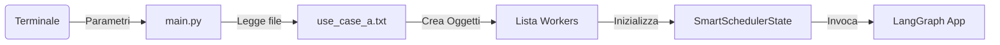
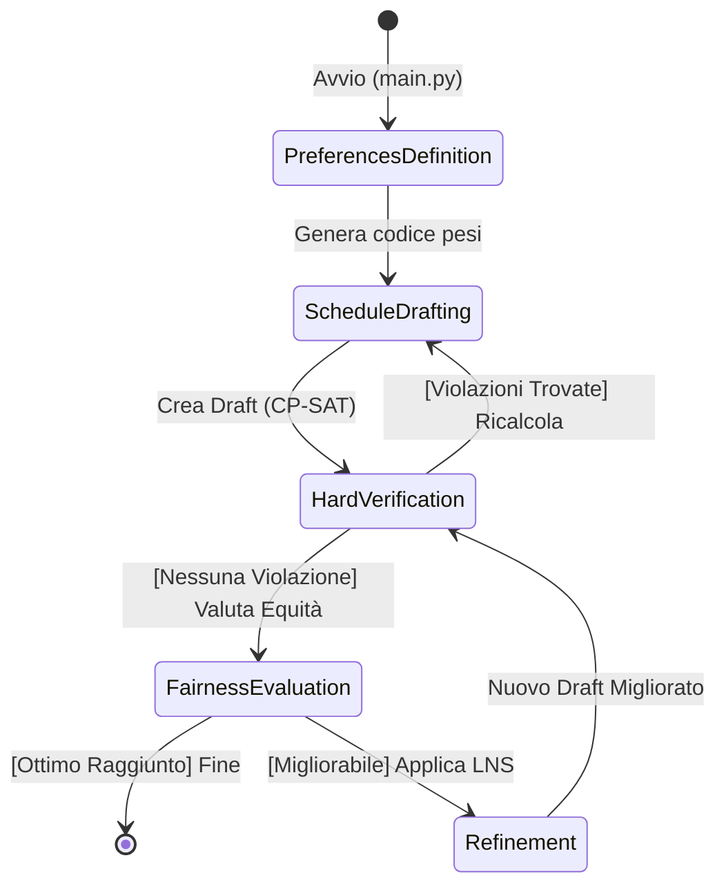
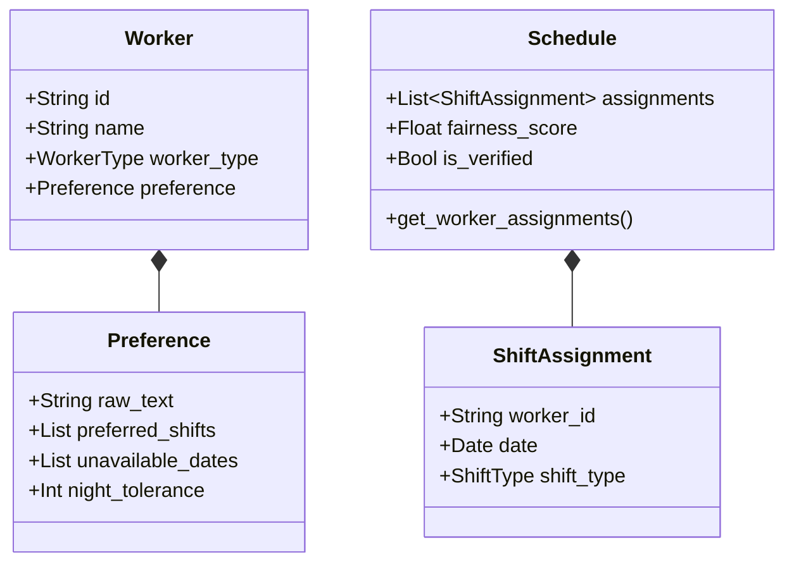

# 🔄 Workflow Dettagliato di Esecuzione - SmartScheduler

Questo documento spiega per filo e per segno l'intero ciclo di vita dell'applicativo **SmartScheduler**, partendo dal momento in cui l'utente lancia il programma fino alla generazione dell'output finale. Analizzeremo i dati in ingresso, le classi richiamate e i file che producono l'output.

---

## 🚀 1. L'Avvio: Entry Point (`main.py`)
Tutto inizia con l'esecuzione del file `main.py` da terminale (es. `python main.py --use-case A --model qwen2.5-coder:7b`).

**Operazioni principali:**
1. **Parsing CLI:** Legge l'use case (A o B) e altre variabili (modello LLM, iterazioni massime).
2. **Caricamento Lavoratori (`load_workers_from_scenario`):** Legge i file txt in `data/scenarios/use_case_a.txt` estraendo anagrafica e preferenze testuali.
   - **Classe Chiamata:** `Worker` (da `models.worker`). Crea un'istanza per ogni medico/infermiere contenente ID, nome e il testo grezzo delle preferenze.
3. **Inizializzazione Stato:** Costruisce il dizionario `initial_state` che seguirà l'esecuzione in tutti i passaggi successivi.
4. **Avvio Grafo:** Invoca il grafo LangGraph compilato (`app.invoke(initial_state)`).

---

## 🧠 2. Il Cuore dei Dati: Lo Stato Globale (`models/state.py`)
L'intera esecuzione si basa su un dizionario chiamato `SmartSchedulerState`. Nessuna funzione globale viene usata: ogni passaggio riceve questo stato, lo legge e ne restituisce una porzione aggiornata.

**Dati di Input principali nello Stato:**
- `workers`: `list[Worker]`
- `use_case`: `"A"` o `"B"`

**Dati che si generano durante il workflow:**
- `ortools_preferences_code`: Stringa Python (i pesi calcolati dall'LLM).
- `schedule`: Oggetto di classe `Schedule` (il tabellone generato dal solutore matematico).
- `violations`: Lista di stringhe (es. errori di legge, "Il medico W01 lavora troppo").
- `fairness_metrics`: Dizionario con il punteggio di soddisfazione (0-1) di ogni lavoratore.
- `least_satisfied_worker`: Stringa con l'ID del dipendente più "infelice".

---

## 🧭 3. Il Flusso del Grafo (Step-by-Step)
L'orchestrazione è definita in `graph/smartscheduler_graph.py`. L'esecuzione attraversa i seguenti Nodi (Nodes):

### Step 1: Estrazione Preferenze (`agents/preferences_agent.py -> preferences_node`)
- **Input:** Lista di oggetti `Worker` con preferenze in testo naturale ("Non vorrei lavorare il giovedì...").
- **Azione:** Interroga l'LLM (tramite `agents/base_llm.py`) passando le biografie testuali. L'LLM restituisce un JSON.
- **Output:** La stringa `ortools_preferences_code`, un codice Python generato dinamicamente che associa pesi numerici ai turni scomodi di ogni dottore. Aggiorna lo stato `preferences_collected = True`.

### Step 2: Creazione del Tabellone (`agents/drafting_agent.py -> drafting_node`)
- **Input:** I dati dei `workers`, l'Use Case, e l'`ortools_preferences_code`.
- **Classi Chiamate:** `ortools_builder.py` e `ortools_runner.py` (dentro `solver/`).
- **Azione:** Viene costruita matematicamente l'equazione del mese ospedaliero (CP-SAT). Si lancia la CPU a calcolare la prima combinazione di turni che funziona geometricamente.
- **Output:** Nello stato viene salvato l'oggetto `schedule` (di classe `models.schedule.Schedule`), un enorme raccoglitore di oggetti `ShiftAssignment` che descrive esattamente chi lavora, dove e quando.

### Step 3: Verifica della Legge (`agents/verification_agent.py -> verification_node`)
- **Input:** L'oggetto `schedule`.
- **Azione:** Uno script Python "spietato" che scorre l'oggetto `schedule` e verifica se la macchina ha commesso reati (es. meno di 2 giorni di riposo dopo una notte, più di 36h a settimana).
- **Routing (Condizione):**
  - Se trova errori: salva le descrizioni nella lista `violations` dello stato e **rimanda il flusso allo Step 2** (`drafting`) per fargli ricalcolare tutto.
  - Se NON trova errori: approva lo schedule e passa allo Step 4.

### Step 4: Valutazione Equità (`agents/fairness_agent.py -> fairness_node`)
- **Input:** Lo `schedule` (legale) e i `workers`.
- **Azione:** Assegna le multe. Se W01 odia le notti ma ne ha fatte 5, il suo "Fairness Score" (da 0 a 1) scende. Si identifica chi ha il punteggio più basso (`least_satisfied_worker`).
- **Routing (Condizione):**
  - L'agente confronta il punteggio minimo attuale con quello del giro precedente. Se è migliorato, **va allo Step 5** (Refinement).
  - Se è uguale o peggiore (o se il limite LNS è raggiunto), il solutore sa di aver raggiunto l'Ottimo Matematico e **termina il flusso (END)**.

### Step 5: Raffinamento e LNS (`agents/drafting_agent.py -> refinement_node`)
- **Input:** Lo `schedule` attuale e le `fairness_metrics`.
- **Azione:** L'algoritmo **LNS (Fix-and-Optimize)**. Trova il 50% dei medici più "felici" e "congela" i loro turni inserendoli come vincoli rigidi (Fix). Prende il medico "infelice" e il resto dei medici e lascia a OR-Tools libertà di scambiare i loro turni per alzare il punteggio del peggiore (Optimize).
- **Output:** Sovrascrive lo `schedule` attuale e **rimanda obbligatoriamente allo Step 3** per certificare che i nuovi scambi non abbiano violato la legge.

---

## 📦 4. Classi di Dati Principali (Pydantic Models)
I file in `models/` assicurano che i dati viaggino sicuri e tipizzati:

- `Worker` (`models/worker.py`): Contiene le entità fisiche. Contiene a sua volta un oggetto `Preference` con i pesi e i giorni preferiti estratti dall'LLM.
- `Schedule` (`models/schedule.py`): L'intero calendario del mese. Contiene liste di giorni.
- `ShiftAssignment` (`models/schedule.py`): La singola assegnazione base, ad esempio: `Worker: W01, Date: 2026-12-07, Shift: MORNING`.

---

## 📊 5. Output Finale: Salvataggio (`main.py -> save_outputs()`)
Quando il Grafo giunge all'`END` (cioè ha generato uno `schedule` legale e con l'equità massima matematicamente raggiungibile), il controllo torna a `main.py`.

La funzione `save_outputs(final_state)` genera due dati finali nella directory `output/`:
1. **Report Testuale (`report_ucA.txt`):** Un file visivo ad altissima leggibilità. Contiene gli istogrammi (es. `██████░░░░`), il calendario giorno per giorno incasellato con icone, ed eventuali violazioni finali residue (se insormontabili).
2. **File JSON (`schedule_final_ucA.json`):** Contiene i metadati, i punteggi di fairness e una lista gigantesca e cruda di tutte le assegnazioni. Serve per l'integrazione di SmartScheduler con database, frontend web esterni, o app mobile per l'ospedale.
